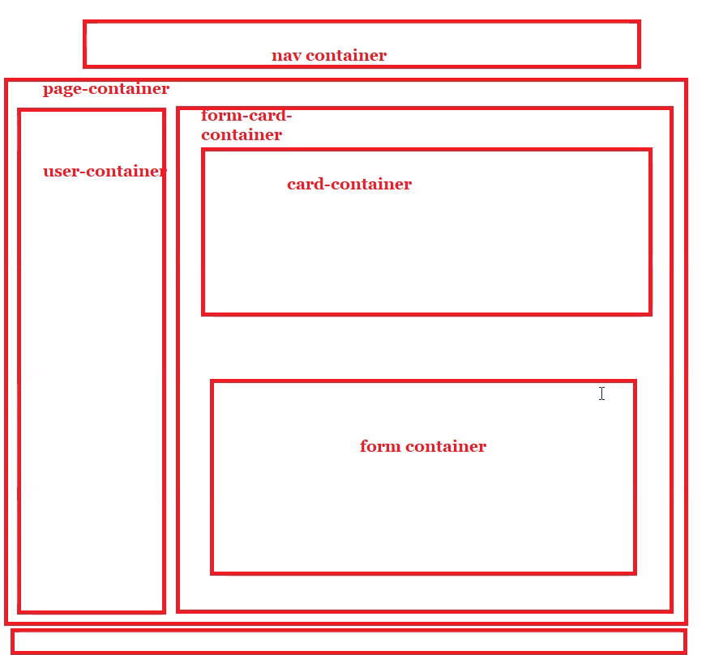

 # Name of Project: Mongooses Project 

 

 ## Overview of the project: 
 - As a team (Daniel, David, Harika, Nissa) each member of the team is responsilble for the content of a different page and content for each of those pages 
 
## Wireframes/prototype

## Link to the deployed project 
 - [Netlify Deployment](https://fighting-mongooses.netlify.app/index.html)

## Project board (yes...even though it is a part of the repo)
- [Link to Fighting Mongoose Project Board](https://github.com/nss-evening-cohort-16/gitsub-the-fighting-mongooses/projects/1)

## Description of the user
- The Fighting Mongooses team members, (Nissa, Harika, David, Daniel) are executing the tasks and producing deliverables outlined in the project plan

## List of features
 - Overview Tab
 - Repos Tab 
 - Projects Tab
 - Packages Tab 

## Screenshots of your project
- [Overview Screenshot](img/ProjectPage.PNG)
- [Repo Screenshot](img/Repos.PNG)
- [Projects Screenshot](img/ProjectPage.PNG)
- [Packages](img/Packages.PNG)

## List of contributors and links to their GH profiles

- [David Vareba](https://github.com/davidvareba)
- [Daniel Sitarek](https://github.com/dsitarek)
- [Harika Suvajk](https://github.com/hcodes11)
- [Charnissa McKinney](https://github.com/Nissa2424)

